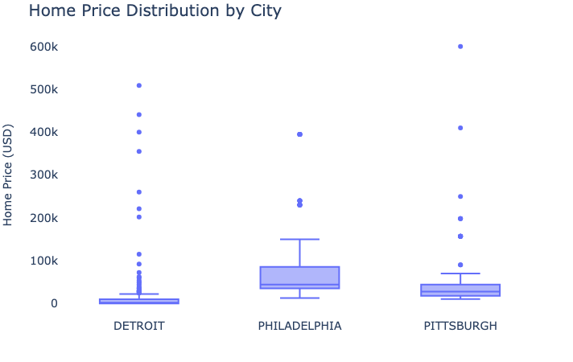
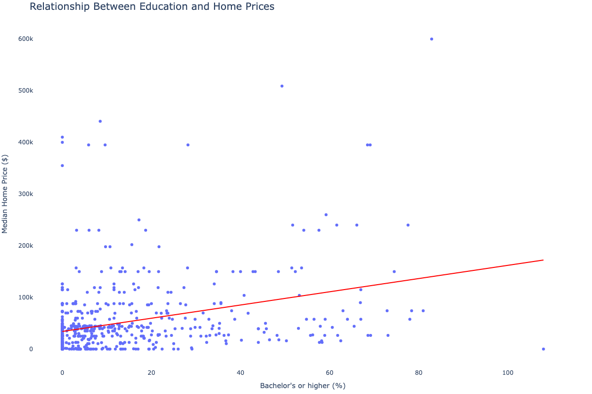
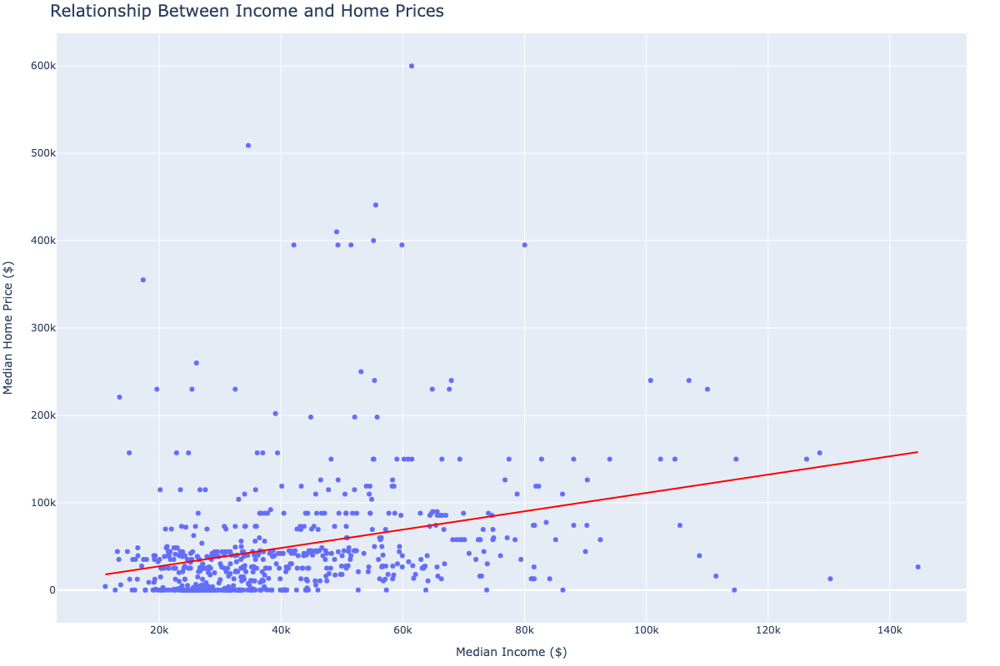

# Location, Location, Location: Predicting Home Values Using Neighborhood-Level Machine Learning Models 

The ability to accurately predict home values using machine learning models has been heavily studied in economics and data science literature. Most of this research focuses on using characteristics of the home itself – square footage, bedrooms, bathrooms – to fine-tune regression models. Recent advances in the field apply cutting-edge ML techniques like neural networks, decision trees, and support vector machines to this problem. **However, the extent to which neighborhood-level characteristics alone explain home values remains unexplored.**

### Key findings
- Data sets from diverse sources like the American Community Survey, city/county open data sites, and the Bureau of Justice Statistics shed light on important neighborhood characteristics.
- Median income, educational attainment, and racial demographics are some of the neighborhood features that most influence home prices.
- Location is important, but it isn’t everything. There is significant variation in home sales within census tracts.

### Methods
- Compiled and harmonized home sales data from 2000-2025 for three U.S. cities – Philadelphia, Detroit, and Pittsburgh.
- Gathered data on neighborhood crime, commerce and demographics for each location.
- Merged sales and neighborhood characteristics data sets.
- Applied linear and non-linear regression techniques to the data set, using neighborhood data as features and the home price as the target column.
- Compared explanatory power of different neighborhood features across cities and regression techniques.

### Data sources*
- real estate sales data
    - [Philadelphia](https://opendataphilly.org/datasets/real-estate-transfers/)
    - [Pittsburgh](https://catalog.data.gov/dataset/allegheny-county-property-sale-transactions)
    - [Detroit](https://data.detroitmi.gov/datasets/detroitmi::property-sales-1/about)
- crime data
    - [Philadelphia](https://opendataphilly.org/datasets/crime-incidents/)
    - [Pittsburgh](https://www.pittsburghpa.gov/Safety/Police/Police-Data-Portal)
    - [Detroit](https://data.detroitmi.gov/datasets/8e532daeec1149879bd5e67fdd9c8be0_0/explore)
- commerce data
  - [Philadelphia](https://opendataphilly.org/datasets/city-registered-local-businesses/)
  - [Pittsburgh](https://data.wprdc.org/dataset/business-contractors-trades)
  - [Detroit](https://data.detroitmi.gov/documents/detroitmi::detroit-business-data-explorer/about?path=)
- demographic data
    - [American Community Survey](https://www.census.gov/programs-surveys/acs/data.html) (all cities)

*clean merged data set available upon request

### Repo contains...
- Data processing: CrimeDataProcessing, SalesDataProcessing, CommerceDataProcessing
- Exploratory Data Analysis: SalesEDA, GeospatialEDA, NeighborhoodDataEDA
- Modeling: 

### Some visualizations

**Home prices vary between and within cities**

**Educational attainment was correlated with home prices**

**So was income**

